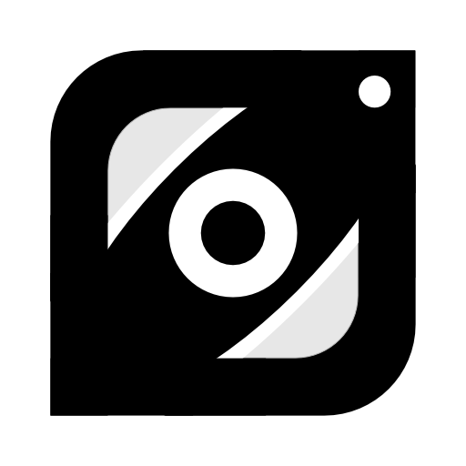

# PeekDock

Automatically capture slides from Zoom meetings — right from your MacBook's notch.



## What it does

PeekDock watches your Zoom window during a meeting and saves a copy of every slide as it changes. No more frantic screenshots, no more asking the presenter to share the deck afterwards.

When the meeting ends, a review window opens so you can pick the slides you actually want and export them as individual PNG images or a single PDF.

The app lives quietly in your MacBook's notch as a pair of animated eyes — glanceable, unobtrusive, and out of your way.

## Features

- **Automatic capture** — detects slide changes and saves each new one
- **Region selection** — drag to mark just the slide area and ignore the speaker tile
- **Notch indicator** — animated eyes show what PeekDock is doing
  - *Idle*: drifting (Zoom isn't running)
  - *Focused*: still (Zoom is running, capture is paused)
  - *Active*: squinting (capture in progress)
- **Post-capture review** — select, reorder, and export only the slides you want
- **PNG or PDF export** — separate images or one combined document
- **Menu bar access** — quick controls from the system menu bar
- **English & Japanese** — follows your macOS system language on first launch, switchable any time from the menu bar (PeekDock → Language)

## Requirements

- macOS 15.0 (Sequoia) or later
- A MacBook with a notch is recommended (the indicator UI is designed for it)
- Zoom

## Installation

1. Download the latest `PeekDock.app.zip` from the [Releases page](https://github.com/<your-github-username>/PeekDock/releases) and unzip it.
2. Move `PeekDock.app` into your `Applications` folder.
3. **First launch** — PeekDock is not notarized by Apple, so macOS Gatekeeper will block it by default. Use one of the following:
   - **Right-click** (or Control-click) `PeekDock.app` → **Open** → confirm **Open** in the dialog. You only need to do this once.
   - If you see "PeekDock.app is damaged and can't be opened", run this in Terminal once:
     ```bash
     xattr -cr /Applications/PeekDock.app
     ```
     then open it normally.
4. Follow the onboarding screen, then grant **Screen Recording** permission when prompted:
   System Settings → Privacy & Security → Screen Recording → enable PeekDock.

## Usage

1. **Launch PeekDock.** The animated eyes appear in your notch.
2. **Start a Zoom meeting.** The eyes switch to *focused*.
3. **Click Capture** in the notch panel, then drag on the Zoom window to mark the slide area. Press `Enter` to confirm (or `Esc` to cancel).
4. **Sit back.** Each time the slide changes, PeekDock saves it. The notch shows a running slide count.
5. **Click Stop** when you're done. The review window opens automatically.
6. **Pick and export.** Click to select/deselect, drag to reorder, then export as PNG or PDF.

### Keyboard shortcuts

| Action | Shortcut |
|--------|----------|
| Confirm region | `Enter` |
| Cancel region | `Esc` |
| Toggle slide in review | `Space` |
| Navigate slides in review | Arrow keys |
| Quit | `⌘Q` |

## Where are my slides?

While a session is running, captures live in `~/Documents/PeekDock/`. Once you export from the review window, files go to the destination you choose. If you discard a session in the review window, its files are deleted.

## Privacy

PeekDock only captures the Zoom window region you choose. Everything runs locally on your Mac — nothing is uploaded.

---

# 日本語

Zoom会議中のスライドを自動でキャプチャ。MacBookのノッチから操作できます。


## できること

PeekDockはZoomウィンドウを監視し、スライドが切り替わるたびに自動で保存します。スクショを取り続けたり、後から資料をもらいに行ったりする必要はありません。

会議が終わるとレビュー画面が開き、必要なスライドだけを選んでPNG画像またはPDFとしてエクスポートできます。

ノッチに常駐する小さな目のアニメーションが、邪魔にならない形で状態を知らせます。

## 主な機能

- **自動キャプチャ** — スライドの切り替わりを検知して保存
- **領域選択** — ドラッグでスライド部分のみ指定（話者タイルを除外）
- **ノッチインジケータ** — 目のアニメーションで状態を一目で把握
  - *アイドル*: ふらふら（Zoom未起動）
  - *フォーカス*: 静止（Zoom起動中、キャプチャ停止）
  - *アクティブ*: 細目（キャプチャ中）
- **レビュー画面** — 取捨選択・並べ替えしてエクスポート
- **PNG / PDF エクスポート** — 個別画像または結合PDF
- **メニューバー** — システムメニューバーから操作可能
- **日本語 / 英語対応** — 初回起動時はmacOSのシステム言語に従い、メニューバー（PeekDock → Language）からいつでも切り替え可能

## 動作環境

- macOS 15.0 (Sequoia) 以降
- ノッチ付きMacBook推奨（ノッチを前提としたUIです）
- Zoom

## インストール

1. [Releases ページ](https://github.com/<your-github-username>/PeekDock/releases) から最新の `PeekDock.app.zip` をダウンロードし、解凍
2. `PeekDock.app` を `アプリケーション` フォルダへ移動
3. **初回起動** — PeekDockはApple公証（notarize）されていないため、Gatekeeperに標準ではブロックされます。以下のいずれかの方法で起動してください:
   - `PeekDock.app` を **右クリック**（またはControl＋クリック）→ **開く** → ダイアログで **開く** を選択。初回のみ必要です
   - 「"PeekDock.app"は壊れているため開けません」と表示された場合は、ターミナルで一度だけ次を実行:
     ```bash
     xattr -cr /Applications/PeekDock.app
     ```
     そのあと通常通り起動してください
4. オンボーディング画面の指示に従い、**画面収録** の権限を許可:
   システム設定 → プライバシーとセキュリティ → 画面収録 → PeekDock を有効化

## 使い方

1. **PeekDockを起動** — ノッチに目のアニメーションが表示されます
2. **Zoom会議に参加** — 目が*フォーカス*状態に切り替わります
3. **ノッチのキャプチャをクリック** — Zoomウィンドウ上でスライド領域をドラッグ → `Enter` で確定（`Esc` でキャンセル）
4. **あとは待つだけ** — 切り替わりを自動検知。ノッチに枚数が表示されます
5. **終了時にStop** — レビュー画面が自動で開きます
6. **選別してエクスポート** — クリックで選択、ドラッグで並べ替え、PNG / PDF で保存

### キーボードショートカット

| 操作 | キー |
|------|------|
| 領域確定 | `Enter` |
| 領域キャンセル | `Esc` |
| レビューで選択切替 | `Space` |
| レビューでスライド移動 | 矢印キー |
| 終了 | `⌘Q` |

## スライドの保存場所

セッション中は `~/Documents/PeekDock/` に保存されます。レビュー画面でエクスポートすると指定した場所に書き出されます。レビュー画面で破棄したセッションのファイルは削除されます。

## プライバシー

PeekDockがキャプチャするのは、あなたが選択したZoomウィンドウの領域だけです。すべての処理はMac上で完結し、外部に何も送信しません。

---

## For developers

PeekDock is a SwiftUI + AppKit macOS app. The Xcode project is generated from `project.yml` with [XcodeGen](https://github.com/yonaskolb/XcodeGen):

```bash
brew install xcodegen
xcodegen
open PeekDock.xcodeproj
```

Built with SwiftUI, AppKit, ScreenCaptureKit, and CoreImage. Targets macOS 15.0+, Swift 5.9+.

## License

MIT — see [LICENSE](LICENSE).

## Disclaimer

PeekDock is an independent project and is not affiliated with, endorsed by, or sponsored by Zoom Video Communications, Inc. "Zoom" is a trademark of its respective owner.

## 免責事項

PeekDockは独立したプロジェクトであり、Zoom Video Communications, Inc. とは一切関係ありません（提携・後援・公認のいずれもありません）。「Zoom」は同社の商標です。
